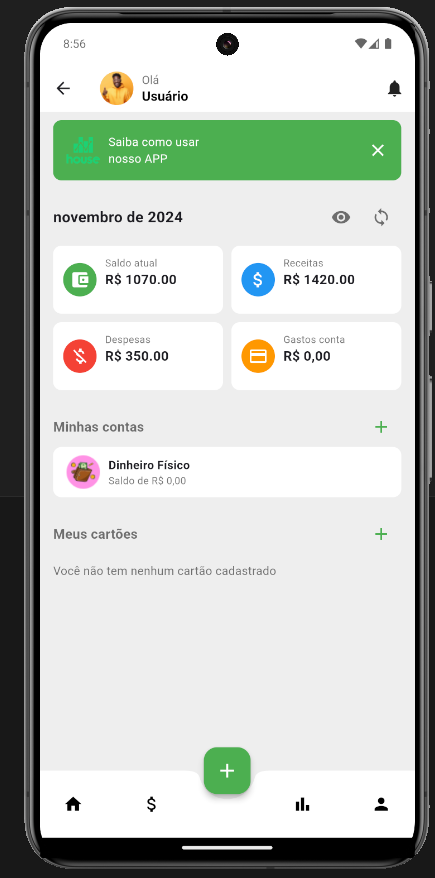
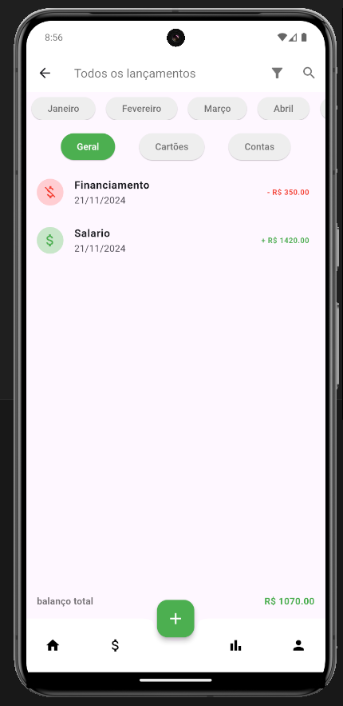
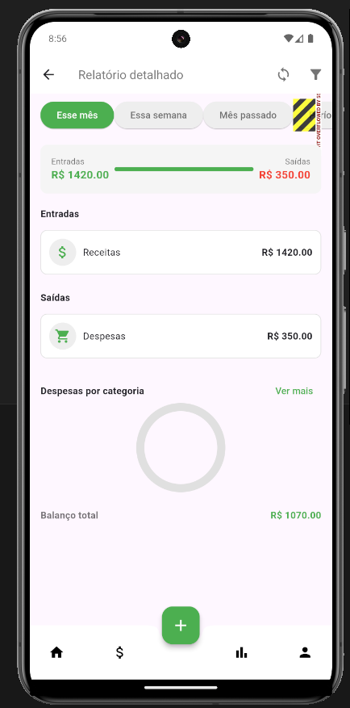

# HouseApp

**HouseApp** é um aplicativo de gestão financeira pessoal desenvolvido em Flutter. Ele permite que os usuários gerenciem receitas, despesas e transferências, além de fornecer relatórios detalhados para acompanhar suas finanças.

## 📋 Funcionalidades

- **Gerenciamento de receitas, despesas e transferências**
  - Adicione, edite e visualize lançamentos financeiros.
  - Categorize suas transações por tipo e conta.

- **Relatórios detalhados**
  - Resumo de entradas e saídas.
  - Gráfico de despesas por categoria.
  - Filtragem por períodos: "Esse mês", "Essa semana", "Mês passado" ou um período customizado.

- **Interface intuitiva**
  - Navegação simples e organizada.
  - Visualização de saldo atual, receitas e despesas no painel principal.

- **Armazenamento local**
  - Utiliza o Hive como banco de dados para salvar e gerenciar dados localmente.

## 🚀 Tecnologias

Este projeto foi desenvolvido com as seguintes tecnologias:

- [Flutter](https://flutter.dev/) - Framework para desenvolvimento de aplicativos multiplataforma.
- [Hive](https://hivedb.dev/) - Banco de dados leve e rápido para Flutter/Dart.

## 🛠️ Estrutura do Projeto

A estrutura principal do projeto está organizada da seguinte forma:

```plaintext
lib/
├── models/               # Modelos de dados (Receita, Despesa, Transferência)
├── screens/              # Telas do aplicativo (Home, Transações, Relatórios, Adicionar)
├── widgets/              # Componentes reutilizáveis
├── assets/               # Imagens e ícones do app
└── main.dart             # Arquivo principal do aplicativo
```

## 💻 Como Executar o Projeto

### Pré-requisitos

- Flutter SDK [instalado](https://flutter.dev/docs/get-started/install)
- Dart SDK (geralmente incluído com o Flutter)
- Emulador ou dispositivo físico conectado para testes

### Passos para execução

1. Clone o repositório:
   ```bash
   git clone https://github.com/Anthony17DEV/HouseApp.git
   cd house_app
   ```

2. Instale as dependências:
   ```bash
   flutter pub get
   ```

3. Execute o projeto:
   ```bash
   flutter run
   ```

## 🖼️ Pré-visualização do App

### Home


### Transações


### Relatórios


## 🛡️ Licença

Este projeto é licenciado sob a RzCodeCo.
